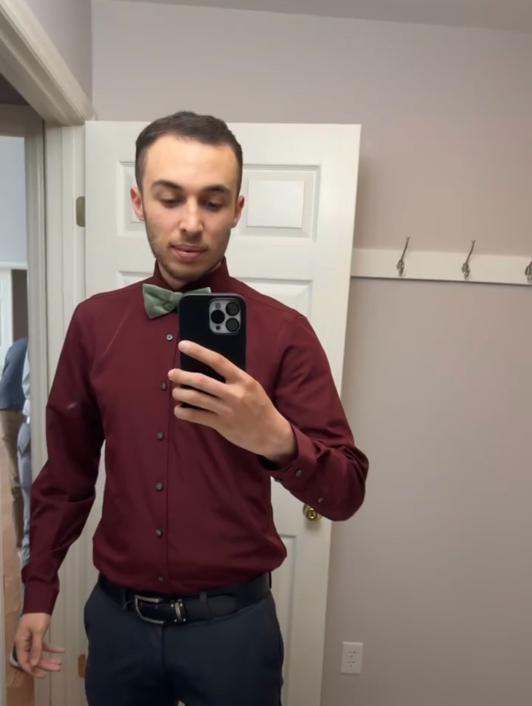

# Jameson's UX Portfolio 

I am a CINS major here at Chico State My career aspirations lie in becoming a Software Engineer or Developer, focusing on building progressive and impactful software solutions.

A fun fact about me is that, outside of academics, I balance full time work and school. I find coding to be a productive hobby that not only sharpens my skills but also keeps me engaged with the latest in technology and programming. This balance has helped me prioritize time management and remain committed to my career aspirations.

## UX Team Project

[AroundU](https://github.com/ChicoState/ux-AroundU/tree/main)

## UX Journal

[Frustrations in Fine Tuning](j01/README.md)
