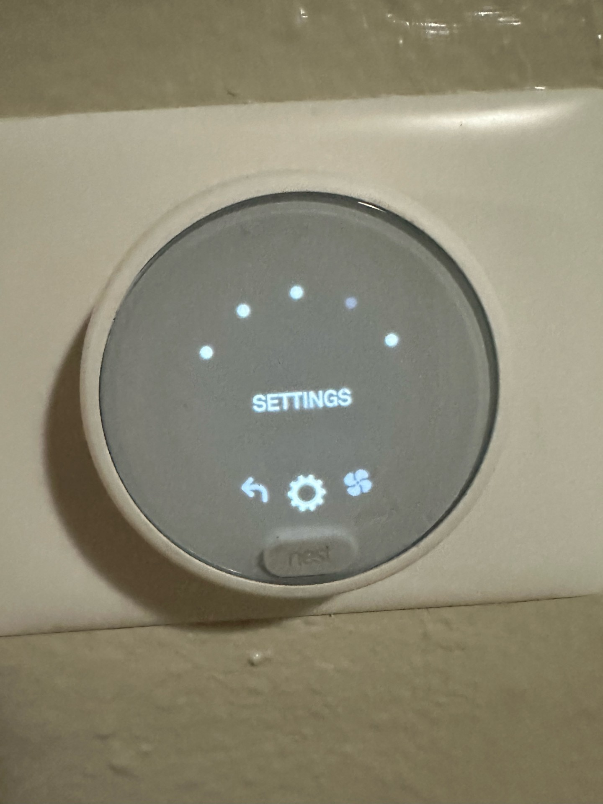
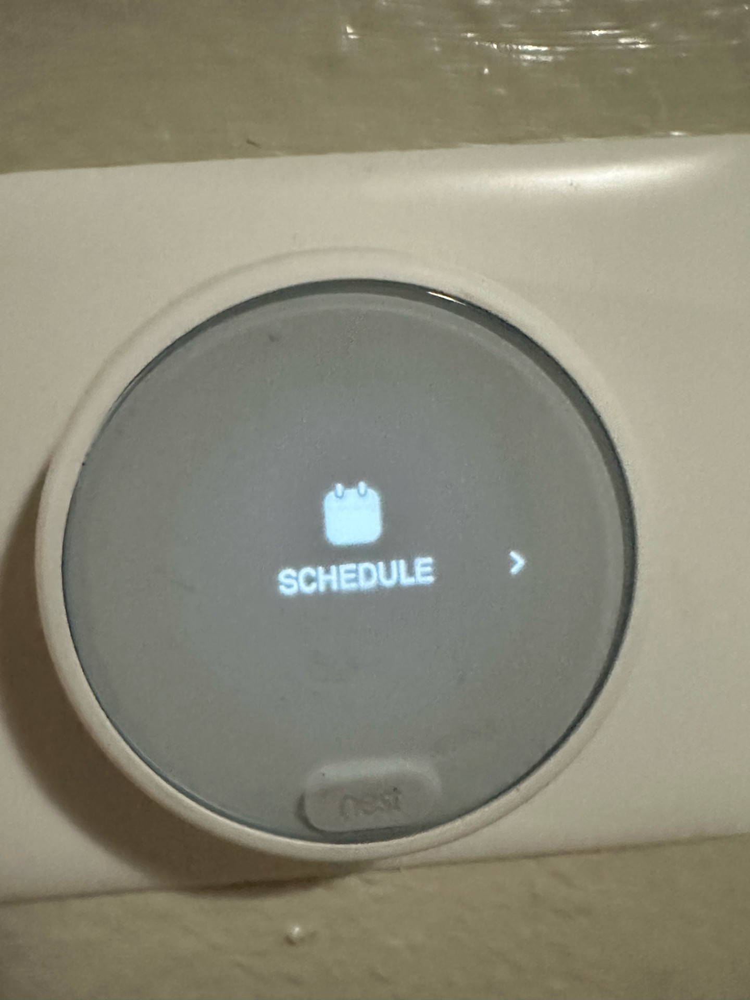
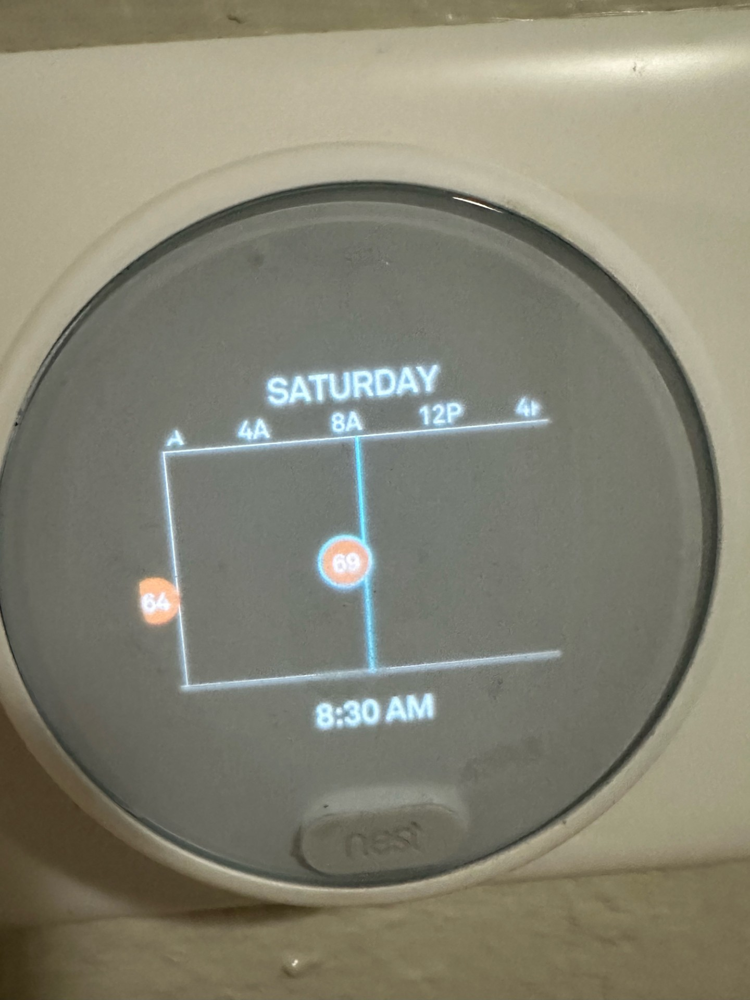
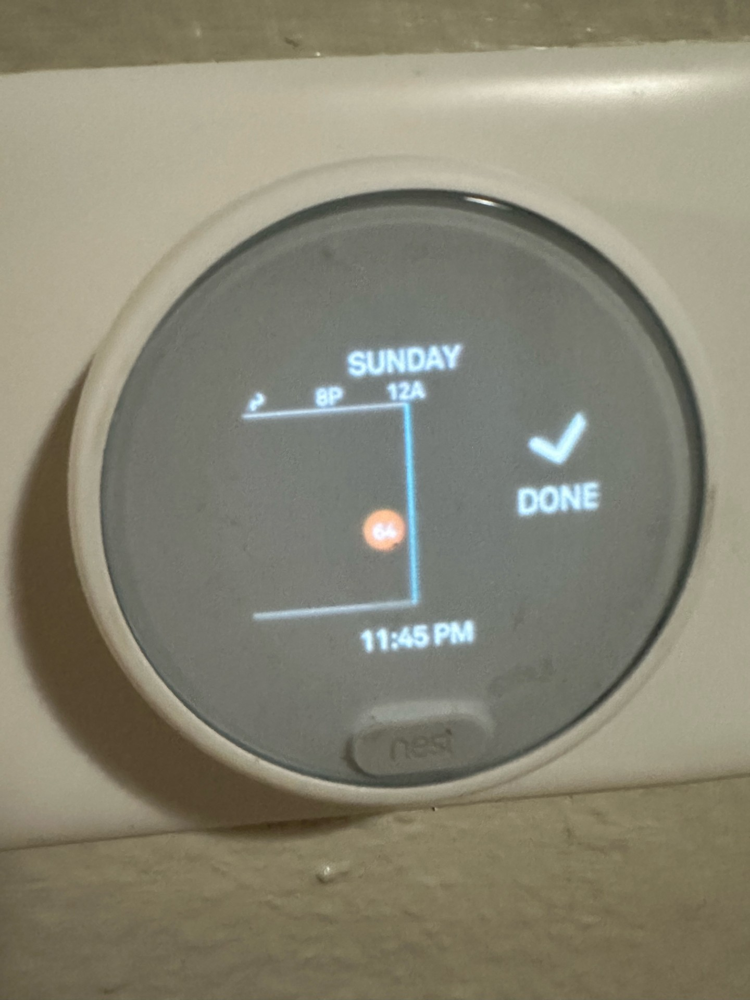
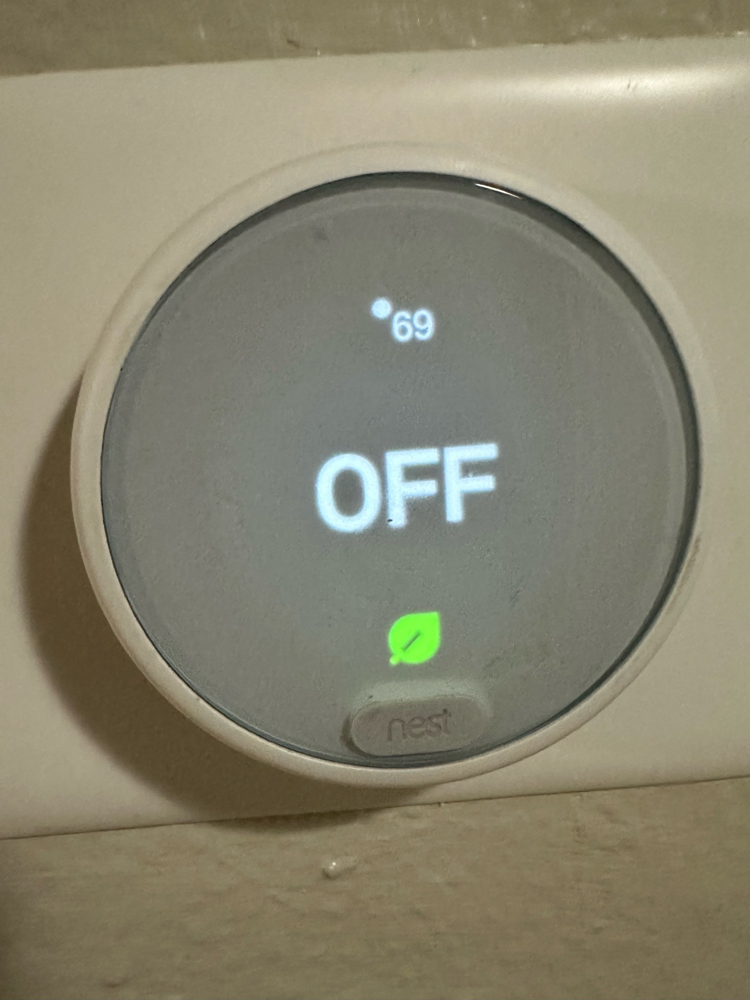

## Scheduling on Google Nest: Frustrations in Fine Tuning

### Jameson White - 11/21/2024

I have found myself working with the Google Nest thermostat more these days as the temperatures continue to change. One thing I thought would help me gain back more time was running the thermostat on a schedule. I hoped that scheduling would automate temperature changes throughout the day without needing my constant attention. However, I quickly discovered that the process of creating and fine tuning a schedule presented several usability challenges.

 

The process began with navigating to the "Settings" menu on the thermostat and selecting "Schedule." My goal was to automate temperature adjustments, ensuring my home stayed warm without needing frequent manual changes. The interface was visually clean and seemed user friendly at first, but I quickly realized it lacked clear instructions, leaving me unsure about how to start making adjustments. As I interacted with the timeline view to set a temperature for 8:30 AM, I discovered that the system only allowed fixed intervals, such as 8:00 AM or 8:30 AM, preventing me from choosing precise times like 8:15 AM. This limitation disrupted the **efficiency** of the process. Additionally, after making changes, there was no confirmation or summary to reassure me that the schedule had been saved, which introduced further uncertainty. This lack of **feedback**, where the system fails to provide clear acknowledgment of user actions, left me questioning whether I had completed the task successfully. The interaction also conflicted with my **mental model**, as I expected the scheduling system to behave like a flexible calendar or planner, allowing precise control over times. This mismatch between my expectations and the system's actual behavior made the interaction more frustrating than expected and highlighted significant usability flaws.

When I attempted to set a new temperature adjustment for 8:30 AM, I noticed that the timeline would only snap to fixed intervals. This restriction made it impossible to choose specific times like 8:15 AM or 8:45 AM, which would have better suited my needs.

The system's lack of flexibility in selecting times added frustration, as I had to settle for less precise settings. I expected a smart device to offer more control, but this limitation contradicted my expectations. While this layout initially appears helpful, the simplicity of the interface masks some limitations that make scheduling less intuitive than expected.

Another point of confusion arose when I tried to confirm the changes I had made. After making adjustments, there was no clear confirmation that the new schedule had been saved. The screen displayed "Done," but it was unclear if pressing this button finalized the changes or if additional steps were required. 

The challenges I encountered with Google Nest’s scheduling feature highlight several areas for improvement. The inability to select specific times outside of preset intervals restricts users' ability to create personalized schedules, limiting the flexibility expected from a smart device. Additionally, the absence of clear confirmation or a summary of changes leaves users unsure if their actions were successful, creating unnecessary uncertainty. Finally, the "Done" button lacks context, making it unclear whether additional steps are needed to finalize adjustments.

To improve the scheduling experience, I recommend several changes. First, allowing users to select more precise time increments, such as 5 or 10 minutes, would provide greater flexibility and better meet individual scheduling needs. Second, introducing a preview or summary screen after adjustments would enable users to review the full schedule with the applied changes, reducing potential errors. Finally, including a confirmation message or a clear visual indicator when changes are successfully saved would eliminate uncertainty and ensure users feel confident that their inputs have been properly applied. Together, these improvements would make the scheduling process more intuitive and user friendly.

